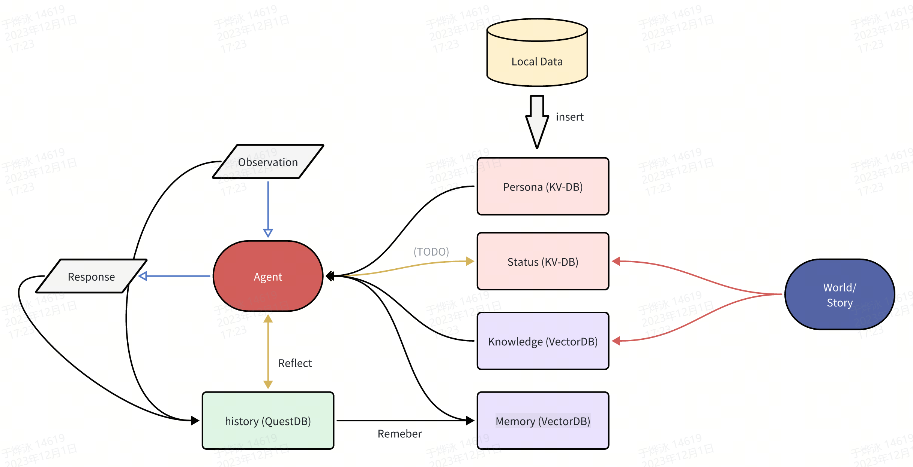
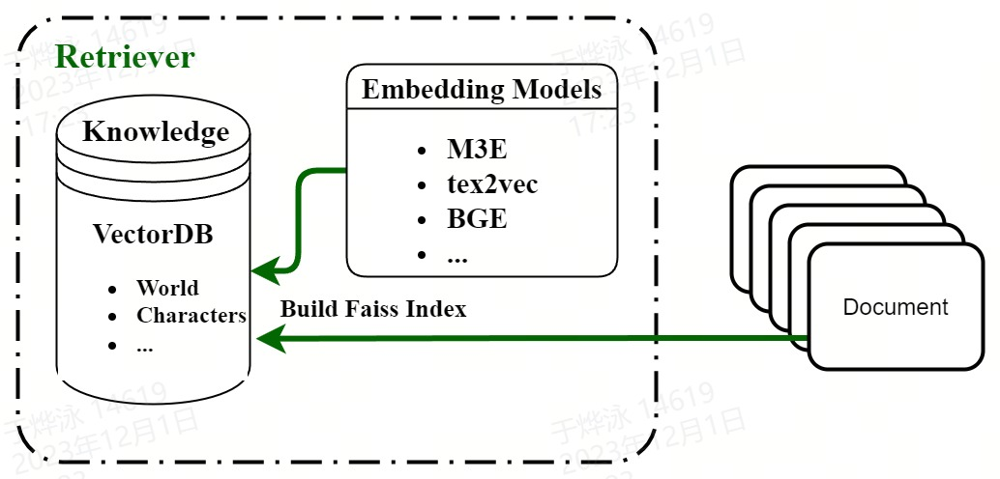
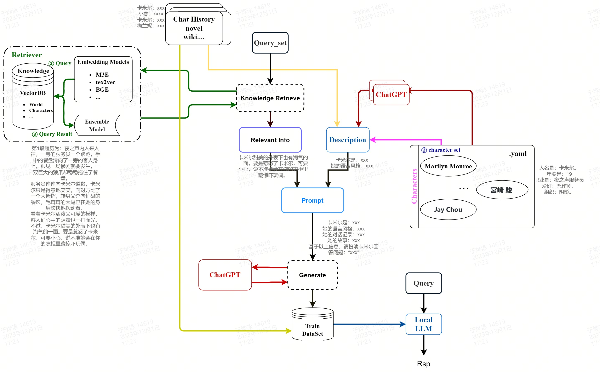

# SGLMAgent


## 🦋 **LLM Agent For SGA**

**Online server framework:**


## 🚨 Preparation

### 1. 安装 **PostgreSQL** ***[Option 1]***
  ```bash
  sudo apt install -y postgresql-common
  sudo /usr/share/postgresql-common/pgdg/apt.postgresql.org.sh
  sudo apt install postgresql-15-pgvector
  ```
  - 修改配置文件使得python可以直接登录postgres账户
  
  数据库配置文件：/etc/postgresql/15/main/postgresql.conf（端口 5432）
  sudo vim /etc/postgresql/15/main/pg_hba.conf
  ```bash
  # "local" is for Unix domain socket connections only
  local   all             all                                     trust
  # IPv4 local connections:
  host    all             all             127.0.0.1/32            trust
  # IPv6 local connections:
  host    all             all             ::1/128                 trust
  ```

  - 服务启动命令
  ```bash
  sudo service postgresql start   # 启动 sudo systemctl start postgresql
  sudo service postgresql stop    # 关闭 sudo systemctl stop postgresql
  sudo service postgresql restart # 重启 sudo systemctl restart postgresql
  ```
  - 安装完毕后，系统会创建一个数据库超级用户 postgres，密码为空。
  ```bash
  sudo -i -u postgres
  ```
  - 这时使用以下命令进入 postgres，输出以下信息，说明安装成功（注意是否启动服务）：
  ```bash
  ~$ psql
    postgres@online-chatbot:~$ psql
    psql (15.4 (Ubuntu 15.4-2.pgdg20.04+1))
    Type "help" for help.
  postgres=# 
  ```
> 具体设置请看：https://lilithgames.feishu.cn/wiki/OYc2wtPHAi1qhckO48YcPIUVnqO

### 2. 安装 **QuestDB** ***[Option 1]***
    
  - 下载 安装包 https://questdb.io/docs/get-started/binaries/
  ```
  tar -xvf questdb-7.3.2-rt-linux-amd64.tar.gz
  ```
  - k8s 已安装路径: `/mnt_data/questdb-7.3-rt-linux-amd64/bin`
  ```
  /mnt_data/questdb-7.3-rt-linux-amd64/bin/questdb.sh start # 启动
  /mnt_data/questdb-7.3-rt-linux-amd64/bin/questdb.sh stop  # 停止
  ```
  - 数据库部署端口 http://localhost:9000/exec

### 3. 安装Redis替换之前的Postgre和QuestDB ***[Option 2]***
1. 安装redis-stack
> https://redis.io/docs
```bash
curl -fsSL https://packages.redis.io/gpg | sudo gpg --dearmor -o /usr/share/keyrings/redis-archive-keyring.gpg
sudo chmod 644 /usr/share/keyrings/redis-archive-keyring.gpg
echo "deb [signed-by=/usr/share/keyrings/redis-archive-keyring.gpg] https://packages.redis.io/deb $(lsb_release -cs) main" | sudo tee /etc/apt/sources.list.d/redis.list
sudo apt-get update
sudo apt-get install redis-stack-server
```
2. 修复系统本地化设置（k8s Pods 需要设置）

- 检查 `/etc/locale.conf` 文件并确保其中的本地化设置是正确的。例如：
```bash
LANG=en_US.UTF-8
```

- 确保本地化设置已经安装
```bash
sudo locale-gen en_US.UTF-8
sudo update-locale LANG=en_US.UTF-8
```
- 如果仍然无法使用`redis-stack-server`启动，长期下面的启动方法
```bash
redis-stack-server /mnt_data/redis_db/redis.conf --_localtime="en_US.UTF-8"
```
3. 后台运行:  `sudo vim /mnt_data/redis_db/redis.conf` 中的daemonize no 修改为
```bash
daemonize yes
```
当以后台运行的方式启动redis，redis会生成一个pid文件，redis.conf中可以设置pid文件的位置。当redis进程关闭时，redis会删除这个pid文件。

4. 启动redis
```bash
redis-server /mnt_data/redis_db/redis.conf
```

5. 关闭redis
```bash
redis-cli shutdown
```


### 4. 安装 **python库**
  ```bash
pip3 insatll -r requirement.txt
python -m spacy download zh_core_web_sm
  ```

  
### 5. 数据库初始化，启动数据库，模型server

  ```bash
cd op
sh run_server.sh
  ```

    
### 6. 运行

  ```bash
python -m experiment.chat
  ```

## 💡 Purpose
  - 1. 辅助算法实验
  - 2. 基础的Agent服务功能

## 🐼 Feature
  - 1. 支持多用户和多角色，通过Session区分
  - 2. 支持时序存储查询（QuestDB），KV存储查询（PostGre），向量存储查询（PGvector）
  
## 🚀 Data Stream

   参考：https://lilithgames.feishu.cn/wiki/W61GwLnEeisD3lk33NwcEzvGn6c

  - Persona：agent不可修改的KV数据库（管理员/world/story可修改）
  - Status：agent可修改的KV数据库
  - History：谁都不可修改的时序数据库
  - Knowledge：agent不可修改的Vector数据库（管理员/world/story可修改）
  - Memory：agent可修改的Vector数据库

## 🤖 Example
  - 运行代码参考 src/experiment/chat.py 和 src/experiment/story_talker.py
  - 以src/experiment/chat.py为例
    - 1. 初始化Agent的数据放在agent_init_data下面，格式参考kuma. kv数据库的key可以在config.json自定义，但是注意要和对应数据的key对应上.
    - 2. 参考src/experiment/algo.py定义prompt
    - 3. 修改src/experiment/chat.py定义agent调用流程
  
  
    ```python
    session = Session()
    test_config = {"use_knowledge": True,
                   "use_memory": False,
                   "use_chat_history": True}
    bot = Agent(config = test_config) 
    bot.set_session(session)  // 切换session，数据库操作都是针对目前的session
    bot.session_init() // 创建和session对应的数据库table，并把数据从文件夹载入到数据库中。如果已经存在数据库中则不需要init
    observation = {"query": "你是谁", "source": "志凯", "time": datetime.datetime.now()}
    test_rsp = bot.chat(observation)
    observation = {"query": "你喜欢我吗", "source": "志凯", "time": datetime.datetime.now()}
    test_rsp = bot.chat(observation)
    observation = {"query": "你认识hahaha吗", "source": "志凯", "time": datetime.datetime.now()}
    test_rsp = bot.chat(observation)
    observation = {"query": "博士去哪里了", "source": "志凯", "time": datetime.datetime.now()}
    test_rsp = bot.chat(observation)
    bot.clear()  //删除所有和目前session相关的数据库table
    ```
    - 4. 执行`python -m experiment.chat`

### TODO SFT
